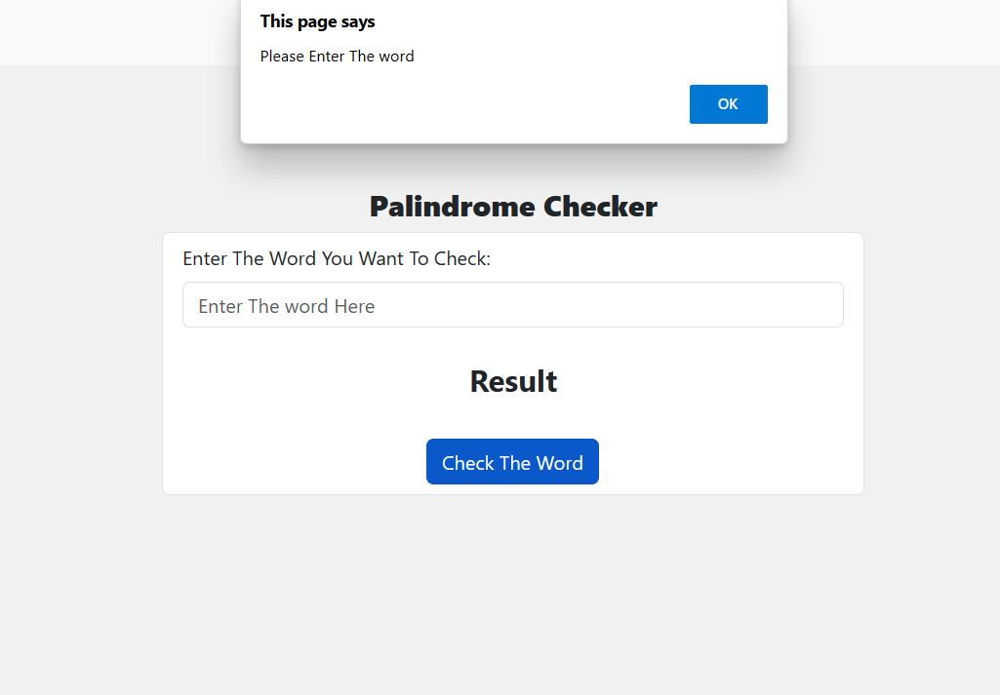

# Palindrome Checker

This Palindrome Checker project is built using HTML, CSS and JavaScript.

### A palindrome is a word or sentence that's spelled the same way both forward and backward, ignoring punctuation, case, and spacing. 

